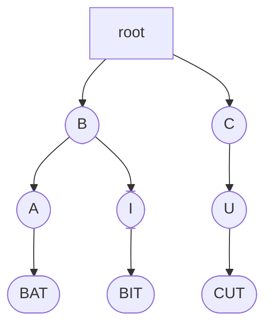
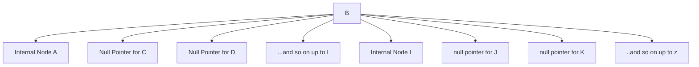
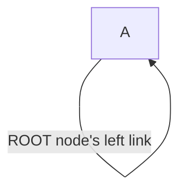
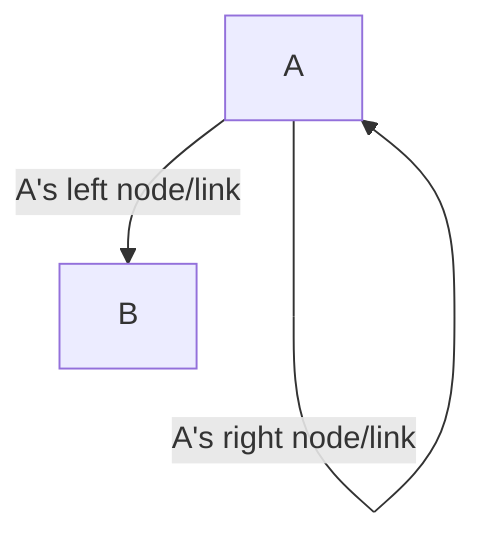
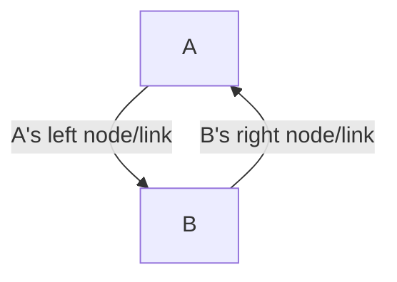
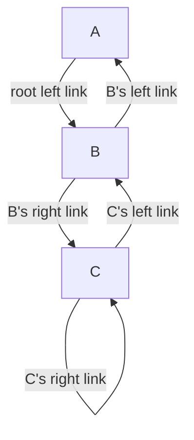
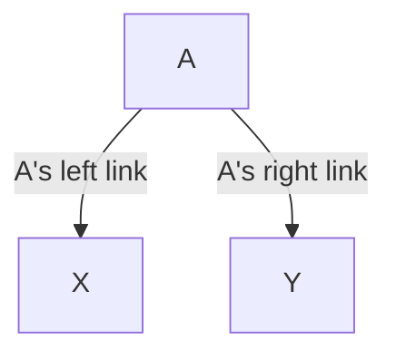
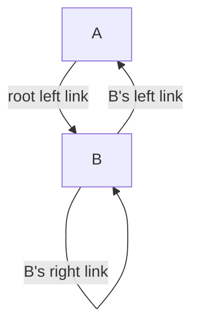
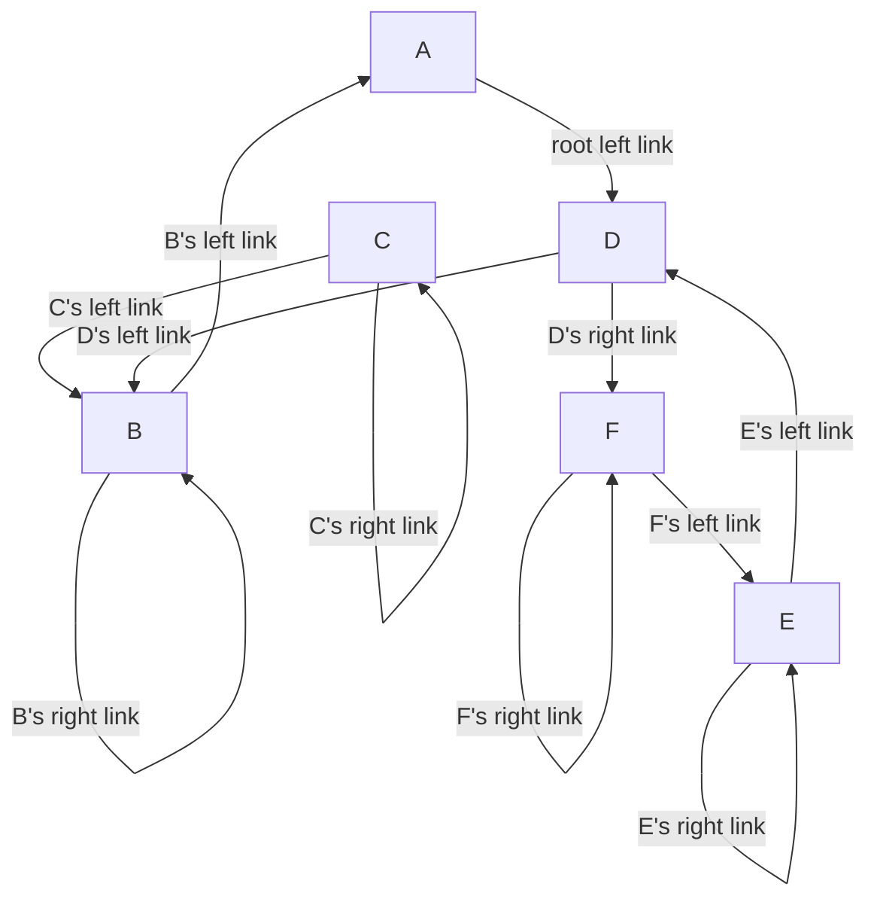

# **PatriciaTrie**

Introduction

This write-up is written to explain how to build a patricia trie and implement the searching (and by extension auto-complete)
and insertion functionality. The implementation presented here follows Knuth's explanation of the inner workings of 
Patricia Tries and tries in general, as detailed in his book: "The Art of Computer Programming

## Basics

To understand how patricia trie works it is important to first turn out attention to Tries since it is from Tries
we can begin to understand why Patricia trie is needed in the first place.

The term "trie" comes from "retrieval," indicating that the data structure is used to retrieve characters or prefixes
from a given character set. A Trie's character set can include both letters and decimal digits.

As defined by Gatson in his book "Handbook of Data Structures and Algorithms," a Trie is a data structure that stores 
characters of a key and can be used to retrieve the entire key or parts of the key. In this context, 
a key refers to a word, such as "Orange."

Components of Trie

A trie is composed of nodes that come in two types: internal or external nodes. An internal node contains an array of 
pointers that point to other nodes or null pointers. The branching of internal nodes is determined by the characters of the keys.
External nodes, on the other hand, store a record or key.

As an example, the parent or starting node utilizes the first character of our key.
Subsequently, its descendant uses the second character, and the descendants following that use the next character 
in sequence, and so forth.



In the illustration above, the root has no label and lacks a node pointing to it. The root serves as the starting
point of tries. The trie comprises several keys: cut, bit, and bat. Consequently, the root has two descendants or children,
namely B and C. B functions as a parent to nodes A and I, while C serves as the parent to U. Nodes A, I, and U are
internal nodes, whereas nodes BAT, BIT, and CUT are external nodes. Notably, the external nodes contain the record.

An interesting observation about tries is that a node's level is equivalent to the index or position of the character
in the key it holds. Therefore, the level of Node A (an internal node) is 2 because A is the second character 
in the word 'BAT.' Similarly, internal node U's level is 2 because U is the second character in the word 'CUT.'

Suppose we wish to determine the array pointer of internal node B. Assuming our trie's character set is based on 
the English alphabet with 26 letters, B's internal node will contain pointers from A to Z and from a to z. 
In the pointer array, character A will point to internal node A, while character I will point to internal node I. 
All the other characters will point to null nodes.



Application of Tries

Tries are well-suited for searching unbounded or infinite keys. By "unbounded" or "infinite,"
we refer to keys whose unique prefixes can lead to a large number of words. For example, consider the English alphabet, 
upon which our trie is based. If we are searching for words with the prefix "B" (or words that start with "B"), 
there are two possibilities: BAT and BIT. Since both possibilities share the same prefix 'B,' 
we can efficiently retrieve either or both compared to traditional data structures such as arrays.
Consequently, tries are useful in applications that require auto-completion and/or search logic.

_An interesting fact is Google search engine uses compressed trie to auto-complete/predict your search queries._

General Shortcomings of Tries

At this point, observant readers may have noticed two things about tries. First, they take up a lot of space, 
especially when the size of our alphabet is large. For example, if our alphabet is based on the extended ASCII alphabet,
the size of our internal nodes will be 256. This can be a problem for devices with limited storage, like IoT devices. 
The second issue is the presence of orphaned nodes, which are nodes that only have one child. In our trie, 
only node B has more than one child (two descendants), while the others have only one child. 
Orphaned nodes lead to redundancy and make memory usage less efficient.

To address these disadvantages, alternative data structures such as compressed forms of Trie were developed to solve these issues.

## Patricia Trie

Basic of Patricia Trie

A Patricia Trie is a compressed version of a trie that uses bits to determine key branching. In a Patricia Trie,
if a parent has only one child, they are merged, 
effectively optimizing the space used. Each internal node in a Patricia Trie stores a bit index, 
which determines the branching (whether to go left or right), while external nodes keep the record or data represented 
by the key. Importantly, using bit indexes helps us avoid the issue of having subtrees with only one child.

Unlike a regular trie, when filling up a Patricia Trie or at the start, the root's left link always points to itself. 
In a non-empty Patricia Trie with only one node (the root node), the root node's left link refers to the root node. 
Additionally, the root node never has a right link.



There are several ways of implementing the basic idea of Patricia tries but perhaps the simplest way is the one which will be discussed
herein.

Rules of Implementation of a Patricia Trie

Before implementing the trie, there are two rules we ought to be aware of

1. Apart from the root which has only 1 child (the left child), all the other nodes must at least have two nodes

2. No key may be a prefix of another, meaning two prefixes cannot overlap. This restriction can be satisfied by adding 
a sentinel value (a unique character) at the end of a text. For example, in the key "A B C D,"
the sentinel value here is the space character (" "). In some implementations, a period (".") is used as a sentinel value.

Components of Patricia Trie

A node in a patricia trie is made up of:

1. Our key's character bit pattern which is usually represented as an array of bits. As an example, in the key/text "A B C D",
the bit-pattern for A is ```01000001```. The bit pattern is what we will use when we are doing comparisons during search
and insert operations. The bit pattern is dependent on the text-encoding used by the programmer. For instance, in our case 
we are using ascii encoding so bit pattern is made up of 8 bits. In some implementations, the bit pattern may be made up
of 4 bits.

2. a skipBit or bitIndex which indicates where branching takes place. We will use this to determine the amount of bits
we need to skip when performing a search or insert operation.

3. left and right links/nodes. The left link(or node) points to the key's left node whereas the right node/link points
to the key's right node. The left and right node might represent either an ancestor, a child/descendant or it may be
pointing to the key itself (when we have a self-loop).


The first figure shows A's left link pointing to its descendant/child and the right node pointing to A (so a self-loop)


The second graph shows A's left link pointing to its descendant/child and the child's right node pointing to A which is 
its ancestor/parent

_To determine whether the node's left and right link point to its ancestor or child, Knuth suggests that each node
should have a left tag and right tag. However, this introduces another complexity during insertion operation. Hence, this 
implementation will show an alternative -- albeit cheeky -- way of determining whether left and right link point to
an ancestor/child or itself._

4. a character/word of the key or text which we will use to do comparison when we are searching for the existence or 
in-existence of a word in our trie. Consider the following key 'A B C D'. Each character is a character of the key. So
'A' can be said to be a character of the key 'A B C D'
Some implementations store the textual representation of the key's character in the node but in our case we will store 
pointers of the character/word. In this case, if our node was to store character A,our key would be 1 since character A
is found at position 1 of our key. If it was to store B, our key would be 2 and if it was to store C our key would 
be 3 and so on.  

5.  A value that can be virtually anything. For our implementation and for simplicity's sake, our nodes won't have 
any value in them but that does not mean they can't have one.  


Implementation of Patricia Trie

Suppose we were implementing auto-completion logic in our application, and our text is "A B C D E F." 
To leverage the Patricia Trie algorithm, we would need two functions:

1. A searching function that takes an input key and returns a node whose key corresponds to the input key.
It will return null if the key does not exist in our trie.

2. An insert function that takes in a new key and creates a newNode referencing the new key. 
The insert function will then insert the newNode into our trie and return the newNode.

In this context, the key will represent the character's position in our text. 
For example, for A, its key will be 1, for B 2, for C 3, for D 4, and so on.

The insert and search operations require: 


1. ```parent``` and ```child``` nodes. At the start, in a non-empty trie, the parent points to the root and the child
points to the root's left link/node

2. The index bit/skip bit. To compute this bit we will need the difference between the bit-pattern of the key we are
trying to insert and the child's bit pattern
3.  The last thing we will need is to retrieve the bit located at the skipBit. We will use this bit to determine the branching
that is: which direction to search for our needed node or which direction to insert our newNode.

Searching in a Patricia Trie

  Pseudocode
  
```
  fun search(key:Int){
      parent = root
      child = root.left
      bitPatternOfKey = calculateBitPatternOfKey(key)
      numberOfBitsInKey=len(bitPatternOfKey)
      jBit = bitOfKeyAtPosition(child.skipBit) ?: 0
      while True
         if child.skipBit > numberOfBitsInKey break
         if child.skipBit == 0: break // a child's skipBit will be 0 only and only when
         // our trie contains the root node only
         s= parent // keep a cache of the parent for every loop round
         
         // if bitAtPosition(child.skipBit) is 0 then we go left else if it is 1 we go right
         
         if jBit==0
            // update parent and child, so parent is assigned to child
             // and child is assigned to child.left
             parent = child
             child  = child.left
         else
            parent = child
            child = child.right
         
         // check whether we are in a self-loop or if the child is pointing to a previously visited node
         // to determine if we are in a self-loop parent == child
         // to determine if  the child is pointing to a previously visited node then our cached parent == child
         // if either of the conditions are satisfied then we can do our comparison
         if (child.key == parent.key or s.key == child.key){
         // we return whether our key is present in our trie and the last previously accessed node/where the search
         // stops. 
           return child.key == key to child 
           
         } else continue // loop further         
     //if we reach here it means our skipBit is greater than the numberOfBitsInKey, so we need to use our initial visited
     // node which is basically our parent since the search terminated at our parent not our child
     return parent.key == key to parent
  }
```

The searching in patricia trie is quite simple. Suppose you have the following trie



_ignore the arrows directions and focus on the tag accompanying the arrow_

and the bitPatterns and skipBits for each of the characters are as follows

```
  A skipBit =0
    bitPattern = 01000001
  B skipBit = 7
    bitPattern = 01000010
  C skipBit = 8
    bitPattern = 01000011     
```
We want to search for B, whose skipBit is ```7``` and bitPattern is ```01000010```. Our search begins at A,
so our ```parent``` is A, and our ```child``` is B. According to our algorithm, we are supposed to take the child's skipBit. 
In our case, since the ```child == B```, our skipBit will be 7. The bitPattern of our key
(B's bitPattern since it is what we are searching for) is ```01000010```. 
The bit at the 7th position is 1.

As established in our pseudocode, if the bit is 1, we go right. Before we move, we need to keep track of our last visited node.
So, we record our initial visited node as the parent, where our current parent is ```A```. 
We move right, and our parent now becomes ```B```, and our child becomes ```child.right``` which equals C.

At this point, we compare and check if we have found our node. So, we compare child.key with our parent.key.
Obviously, this comparison fails since the child is ```C``` and the parent is ```B```. We also compare our 
initially last visited node, which is ```A```, with the child, which is ```C```.

None of the comparisons succeed, so we continue with our search. We update the skipBit to C's skipBit since our child == C.
Now the skipBit is 8, and we look at the searchKey's 8th bitPattern, which is 0. Once again, we record our initially visited node, 
which in this case is ```B```. We go left, update the parent to ```C```, and the child to ```B``` (C.leftLink == B). 
We perform our comparison again, and this time it succeeds since child.key equals our last visited node's key,
which is ```B```.

The same procedure is to be repeated for other keys.


 Patricia Insert 


Now unto insert operation. 

the pseudocode for insert operation is as follows

```
   fun insert(key){
        if root == null
           // insert root
           root = newNodeWithKey(key)
           root.left = root
           root.skipBit =0
           return root
        // we have a root 
        (found, toBeParentNode) =searchForNodeWithKey(key)    
        if found: return toBeParentNode
        
        // not in our trie
        // the searched node == last accessed node and it
        // will act as our parent of our new-to-be inserted node
        // so find the difference in
        // bit Patterns between the last-accessed node and our key's bit pattern
        
        jBit = bitDifferenceOf(toBeParentNode,key'sBitPattern)
        
        newKey =  key'sBitPattern.takeTheFirst[jBit-1]
        
        // our second search will give us the node to link with our new-to-be-inserted node
        
        val nodeToLink=searchForNodeWithKey(newKey)
        
        // we need to determine the direction to link our nodeToLink with our newNode
        // so we get the nodeToLink skipBit and then search for the bit at that position in
        // our key's bitPattern. If the bit is 0, our newNode will be linked to the leftside
        // of our nodeToLink, but if it is 1, our newNode will be linked to the rightSide of
        // of our nodeToLink
        
        val directionBit=positionOfBitAtKey'sBitPattern(nodeToLink.skipBit)
          // this is used to cache our nodeToLink's left or right link
        
        previousNode:Node
        if directionBit ==0:
             previousNode = nodeToLink.leftNode
             node.leftNode = newNode
        else:
            previousNode = nodeToLink.rightNode
            node.rightNode = newNode
        
        // determine the right and left links of our new Node
        newNodeDirectionBit = key'sBitPattern.get(jBit-1)
        
        if newNodeDirectionBit == 0
             newNode.leftNode = newNode // the node points to itself
             newNode.rightNode = if(toBeParentNode == node) previousNode else toBeParentNode         
      
        else
            newNode.rightNode = newNode // right link points to itself
            newNode.leftNode = if(toBeParentNode == node) previousNode else toBeParentNode
   
   
        // update root if either the last-accessed node == root or the
        // toBeParentNode == root
        if(node.key ==root || toBeParentNode.key==root) root=node
       
        return newNode 
   }
```

The insertion pseudo-code can be challenging to understand, so let's break down the process step by step. 

Suppose our trie currently only has A as the root, and now we want to insert B. The first step is to perform a search operation to check 
if B is already in our trie.

Starting with the search operation, the parent will be A, and the child will also be A since our trie currently contains
only the root node, and initially, our root node's left link points to itself. Since the child's skipBit is 0, 
our search operation will be unsuccessful, and the last accessed node will be A. 
Therefore, A will be the parent for our to-be-inserted node, which is B.

The next step is to determine the difference between our to-be parent (A) and our to-be newly inserted node (B). 
In this case, the difference in bitPattern occurs at the 7th position. This bit difference will become our newNode's skipBit,
so B's skipBit will be 7.

The third step will be to determine the direction in which we will attach our new node to our to-be-parent (in this case A).

From our last search, the last accessed node was A, whose bitPattern is ```01000001```. B's bitPattern is ```01000010```. 
The two bitPatterns differ at _position 7_, so from position 1 to 7-1, the bitPatterns are actually similar, ```010000```. 
Therefore, the new bitPattern can be considered a common prefix between A and B. Since one of the rules of a Patricia Trie 
is 'no prefix can overlap another,' we need to perform a search using the newBitPattern to determine the node to which we 
are going to link our new, to-be-inserted node (B). If we perform a search using the newBitPattern ```010000```, we will 
get A as the last accessed node in our second search. The A we get from our second search will be our ```nodeToLink```.

Using the nodeToLink.skipBit, we find the bit at that position in our key's bitPattern. Since our nodeToLink's skipBit is 0,
the bit at that position in the key's bitPattern is 0. Therefore, we attach node B to the left of our nodeToLink (node A).


But before we assign the nodeToLink's left side to node B, we need to first record/save (or cache) nodeToLink's left side. 
The astute reader will probably understand why we need to do this.

By way of explanation, suppose our node A with skipBit 6 was not really our root (for argument's sake), 
and its left link was pointing to some other node, let's call it 'X,' with skipBit 7, and its right node was pointing 
to another node 'Y' with skipBit 8 as shown below.



If we are to insert a newNode Z with skipBit 7 to A's right link, one might wonder where exactly we would take Y or how
we would link A to Z while ensuring that node Y retains its rightful position. This is where the previously recorded node comes in.
We need to remember/cache A's right link (which in this case is Y). Then we assign A's right link to our new node Z.
To complete the linking, we need to link our newNode Z with A's previous right link, which is Y. 
This is necessary because Z displaced Y, and we need to re-adjust.

_Recall that I mentioned I would show you a cheeky way of determining whether a node points to an ancestor or a child?
Well, this is the 'Ahaaa'/'Eureka' moment. In the above flowchart, A is a parent of both X and Y.
When we want to insert a new Node Z and link it with an ancestor/parent that has another node as the child,
you need to know where to place the existing child. How do we determine this? Well, it's simple. 
The incoming new node Z and the existing node Y share the same ancestor. Since Z is supposed to take the place of Y, 
Z will connect with Y, and A will connect with Z. That way, if you take the path Y -> Z, you will end up at A. 
This is the reason why in the pseudo-code, we introduced a variable called previousNode whose purpose is to store a 
parent's initial link and then connect that initial link to the new incoming node only if the incoming node and 
the existing child share the same parent._

The next and final step of our insertion operation is to determine the direction in which we will link our newNode with
our parentNode – that is, the node that was last accessed during our first unsuccessful search.
If the bit at position jBit-1 is 0, then our newNode.leftLink will point to itself (a self-loop), 
and the rightLink will point to our previous node if the nodeToBeLinked (from our second search) is similar to our toBeParentNode. 
Otherwise, the rightLink of our newNode will point to our toBeParentNode. 
In this case, B's left link will be pointed to A, and its right link will be pointed towards itself.

For sanity check, we check to see if our toBeParentNode's key is similar to our root's key or if our nodeToBeLinked's 
key is similar to our root's key. If either is true, we just update our root to our nodeToBeLinked.


Now our trie will have 

Let's do one more to cement the insertion operation concept.

Suppose we are inserting C, whose bitPattern is ```01000011```. We start with our first search to ascertain that C is not in our trie.
During the first search and in the first loop, the parent will be A, and the child will be B. The skipBit will be 7, 
and the bit at position 7 of C is 1, so we will move right. Once we update the parent and child, they will both be B.
We break out of the loop since child == parent. Therefore, B becomes our last accessed node for the first search, 
making B the parentToBe node.

Secondly, the difference between B's bitPattern and C's bitPattern occurs at position 8, so 8 becomes the skipBit of our newNode (C).
We take the first 8-1 bits of C's bitPattern, and we perform a new search using C's newKey ```0100001```.

In the second search, our last accessed node will be B, so B becomes our nodeToLink. Since ourNodeToLink's skipBit is 8, 
and C's bit at that position is 1, we will link B's right with C.

Lastly, we determine the direction to link our parentToBeNode with our newNode C. Since the bit at jBit-1 (8-1) of C's
bitPattern is 1, C's right node will point to itself, and its leftNode will point to B.

An interested reader who continues to insert our keys all the way upto 'F' will notice that the skipBits will be in ascending 
order from the root all the way up to G. 

If the keys are inserted correctly by the reader, the following flow chart shows the resulting trie for keys "A B C D E F "



Parting Shot

A keen reader will notice that, even though I have mentioned one of Trie's applications is to implement an auto-complete logic, 
I haven't quite shown how. I leave this as an exercise for you, the reader.
Simply put, try to determine how exactly we can use our Patricia Trie to carry out an auto-complete logic.

_A hint: the answer lies with the search function,
and in particular, the last accessed node after a search operation._

The corresponding kotlin implementation can be found here: [PatriciaTrie Kotlin](https://gist.github.com/GibsonRuitiari/ade41d75def0374f4c261a0aa3072c69)

Conclusion

If you have made it up to here, and you have understood most of the content then you deserve a pat on the back :xd.

Compared to hashtables, Patricia trie outshine them when it comes to searching particularly for pretty long keys/texts. The
keyword to note is 'long keys'. When it comes to short keys or keys that are finite or bounded, their advantage over hash-tables
is actually negligible. Hence, for applications that store long texts, like search engines, implementation of patricia trie
can translate huge gains when it comes searching of texts.

 I hope this write enabled you to understand how Patricia tries and tries in general work and how to implement
 them :-). 
 
[References]

1. The Art of Computer Programming Chapter 6, section 6.3
2. The Handbook of Algorithms and Data Structures section 3.4.4.5 pg 140
